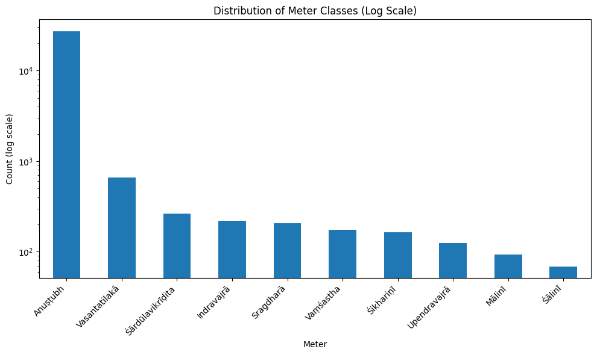

# FILES

| File Name                          | Size      | Description   |
|:------------------------           |:-----:    |:------------- |
| `gitapress_v3_sn_hi`               | **74941** | Original file | 
| `gitapress_v3_sn_hi_uvach_removed` | **74941** | Original file with occurence of `uvach with noun` removed from sanskrit verse| 
| `v3_gitapress_meter_analysed`      | **74941** | File with skrutable meters, our verifier meters and syllable counts              | 
| `v3_gitapress_skr_equal_verifier`  | **29183** | Subset of above file, after adjusting the meter names, where both skrutable and our verifier gives the same meters.| 
| `v3_gitapress_final`               | **29183** | v3_gitapress_skr_equal_verifier with prompts and splits |
| `v3_gitapress_final_1shot_prompts` | **29173** | v3_gitapress_skr_equal_verifier with prompts and splits, 10 samples taken from train set for 1shot, one for each meter and updated to prompts. So this file has 1-shot prompts |

# Column descriptions 

| Column         | Description |
| :-----         | :---------  |
|sa	             | sanskrit verse |
|hi	             | hindi meaning corresponding to verse|
|skr_out         | meter analysis by skrutable     |
|syllable_count	 | syllable count using skrutable  |
|skr_meter	     | meter extracted using skr_out   |
|meter_cd	     | meter given using our verifier  |
|comments	     | analysis for errors like unmatched syllable count and skrutable vs out meter mismatch |
|prompt          | prompt build using specified format and meter rules. Detail in prompt section |
|split           | label of `train`, `test`, `val` stratified splitting on full dataset |

# Finally chosen meters to work on. 

| Meter            | Syllable Count | Data Percentage | Data Count |
| :------------    | :-----------   | :-------------  | :--------- |
| Vasantatilakā    |  56            |   2.265017      |   661      |
| Anuṣṭubh         |  32            |  93.232361      | 27208      |
| Śārdūlavikrīḍita |  76            |   0.908063      |   265      |
| Mālinī           |  60            |   0.318679      |    93      |
| Indravajrā       |  44            |   0.747010      |   218      |
| Śālinī           |  44            |   0.236439      |    69      |
| Vaṃśastha        |  48            |   0.596238      |   174      |
| Śikhariṇī        |  68            |   0.561971      |   164      |
| Upendravajrā     |  44            |   0.424905      |   124      |
| Sragdharā        |  84            |   0.709317      |   207      |

					


# Prompts

- Prompts rules received from file [gitapress_with_prompts.csv](https://drive.google.com/file/d/16-a-ZbmWgr_Qf4p_2HR2olGrIVBdwmbw/view?usp=sharing)
## Generic Prompt structure

```
Objective:

Generate a {target_language} verse in {chandas} meter based on a given meaning or theme while strictly following the metrical (?and rhyme) rules.

Rules of Chandas:
{rules}

Language:
The generated verse must be in {target_language} in Devanagri script.
The Input given is in the {source_language}.
Do NOT include English words, transliteration, labels, or explanations.

Output Format:
(Output exactly 4 lines, one pada per line. Nothing else.)

Examples: [Only present in few-shot prompts files]
Meaning:
<hi>

Sanskrit Verse:
<sa>

Meaning: [From here written in the model's user-instruction in inference/training file, not in csv file]
{row['hi']}

Generate the Sanskrit verse.

```

- `target_language` = Sanskrit
- `source_language` = Hindi
- `rules` = rules of all 10 meters available in chanda_rules.json file

# Output Files naming code

- Folder: Output/
- UT: untrained model (not finetuned)
- FT: finetuned model 
- ZS: zeroshot experiment
- nS: n-shot experiment

# Token count analysis on train split only

| Model           | Dataset                      | Split   | Columns    |   Samples |   Min |   Median |   Mean |   90p |   95p |   99p |   Max |
|:----------------|:-----------------------------|:--------|:-----------|----------:|------:|---------:|-------:|------:|------:|------:|------:|
| microsoft/phi-4 | Files/v3_gitapress_final.csv | train   | sa         |     23346 |    63 |       86 |  90.46 |    98 |   125 |   202 |   248 |
| Qwen/Qwen3-14B  | Files/v3_gitapress_final.csv | train   | sa         |     23346 |    58 |       80 |  83.31 |    91 |   115 |   186 |   231 |
| unsloth/phi-4   | Files/v3_gitapress_final.csv | train   | prompt, hi |     23346 |   509 |      612 | 625.11 |   684 |   726 |   860 |  1305 |