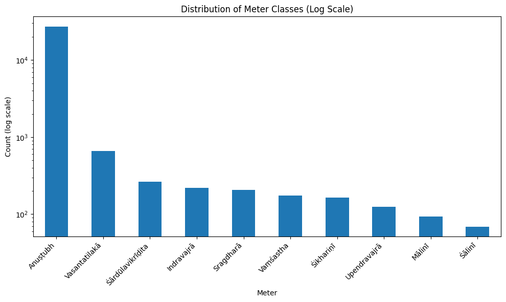

# FILES

| File Name                          | Size      | Description   |
|:------------------------           |:-----:    |:------------- |
| `gitapress_v3_sn_hi`               | **74941** | Original file | 
| `gitapress_v3_sn_hi_uvach_removed` | **74941** | Original file with occurence of `uvach with noun` removed from sanskrit verse| 
| `v3_gitapress_meter_analysed`      | **74941** | File with skrutable meters, our verifier meters and syllable counts              | 
| `v3_gitapress_skr_equal_verifier`  | **29183** | Subset of above file, after adjusting the meter names, where both skrutable and our verifier gives the same meters.| 
| `v3_gitapress_final`               | **29183** | v3_gitapress_skr_equal_verifier with prompts and splits |
| `v3_gitapress_final_1shot_prompts` | **29173** | v3_gitapress_final with prompts and splits, 10 samples taken from train set for 1shot, one for each meter and updated to prompts. So this file has 1-shot prompts |
| `v3_gitapress_final_3shot_prompts` | **29153** | v3_gitapress_final with prompts and splits, 30 samples taken from train set for 3shot, one for each meter and updated to prompts. So this file has 1-shot prompts |
| `v3_gitapress_final_5shot_prompts` | **29133** | v3_gitapress_final with prompts and splits, 50 samples taken from train set for 5shot, one for each meter and updated to prompts. So this file has 1-shot prompts |
| `v3_gitapress_final_vasantatilaka` | **661**   | v3_gitapress_final with 0 shot prompts and splits, with only vasantatilaka meter |
| `v3_gitapress_final_anustubh` | **27208**   | v3_gitapress_final with 0 shot prompts and splits, with only anustubh meter |

# Column descriptions 

| Column         | Description |
| :-----         | :---------  |
|sa	             | sanskrit verse |
|hi	             | hindi meaning corresponding to verse|
|skr_out         | meter analysis by skrutable     |
|syllable_count	 | syllable count using skrutable  |
|skr_meter	     | meter extracted using skr_out   |
|meter_cd	     | meter given using our verifier  |
|comments	     | analysis for errors like unmatched syllable count and skrutable vs out meter mismatch |
|prompt          | prompt build using specified format and meter rules. Detail in prompt section |
|split           | label of `train`, `test`, `val` stratified splitting on full dataset |

# Finally chosen meters to work on. 

| Meter            | Syllable Count | Data Percentage | Data Count |
| :------------    | :-----------   | :-------------  | :--------- |
| Vasantatilakā    |  56            |   2.265017      |   661      |
| Anuṣṭubh         |  32            |  93.232361      | 27208      |
| Śārdūlavikrīḍita |  76            |   0.908063      |   265      |
| Mālinī           |  60            |   0.318679      |    93      |
| Indravajrā       |  44            |   0.747010      |   218      |
| Śālinī           |  44            |   0.236439      |    69      |
| Vaṃśastha        |  48            |   0.596238      |   174      |
| Śikhariṇī        |  68            |   0.561971      |   164      |
| Upendravajrā     |  44            |   0.424905      |   124      |
| Sragdharā        |  84            |   0.709317      |   207      |

					


# Prompts

- Prompts rules received from file [gitapress_with_prompts.csv](https://drive.google.com/file/d/16-a-ZbmWgr_Qf4p_2HR2olGrIVBdwmbw/view?usp=sharing)
## Generic Prompt structure

```
Objective:

Generate a {target_language} verse in {chandas} meter based on a given meaning or theme while strictly following the metrical (?and rhyme) rules.

Rules of Chandas:
{rules}

Language:
The generated verse must be in {target_language} in Devanagri script.
The Input given is in the {source_language}.
Do NOT include English words, transliteration, labels, or explanations.

Output Format:
(Output exactly 4 lines, one pada per line. Nothing else.)

Examples: [Only present in few-shot prompts files]
Meaning:
<hi>

Sanskrit Verse:
<sa>

Meaning: [From here written in the model's user-instruction in inference/training file, not in csv file]
{row['hi']}

Generate the Sanskrit verse.

```

- `target_language` = Sanskrit
- `source_language` = Hindi
- `rules` = rules of all 10 meters available in chanda_rules.json file

# Output Files naming code

- Folder: Output/
- UT: untrained model (not finetuned)
- FT: finetuned model 
- ZS: zeroshot experiment
- nS: n-shot experiment

## Evaluation Pipeline

This script evaluates generated Sanskrit verses (`model_out`) against
ground-truth meter and syllable-count labels, and reports how semantically
faithful the generations are to their source input (`hi`).

It is run as:

```bash
python evaluate.py <path_to_csv>
```

The input CSV must contain the following columns:

| Column            | Meaning                                              |
|-------------------|-------------------------------------------------------|
| `hi`              | Source text fed to the model                          |
| `meter_cd`        | Ground-truth meter                                     |
| `syllable_count`  | Ground-truth syllable count                            |
| `model_out`       | Model-generated Sanskrit verse                         |

The script adds `out_meter`, `pred_syllable_count`, `half_acc`, `full_acc`,
and `semsim` columns, and overwrites the CSV in place with these results.

### 1. Problem-row detection

Before scoring, each `model_out` value is checked for stray Latin
alphanumeric characters (e.g. leftover English tokens or malformed output).
The digit `5` is excluded from this check, since models sometimes use it to
represent the avagraha (ऽ). Rows that fail this check are:

- Marked `"problem"` in `out_meter`
- Saved separately to a `..._problem_cols.csv` file for inspection
- Skipped by meter/syllable detection, but **still included** in scoring
  (see below) rather than dropped from the dataset

### 2. Meter and syllable detection

For all non-problem rows, two independent tools are run on `model_out`:

- **`chandas_detector`** — detects the meter of the verse. A meter is only
  recorded if detection confidence is `"exact"`; otherwise the row is
  treated as `UNKNOWN`.
- **`skrutable.MeterIdentifier`** — scans the verse (`from_scheme="DEV"`,
  `resplit_option="resplit_lite"`, `resplit_keep_midpoint=True`) and counts
  syllables from the resulting light/heavy (`l`/`g`) weight string.

### 3. Row-wise metrics

Two binary metrics are computed per row:

- **`half_acc`** — 1 if the predicted syllable count matches the ground
  truth, else 0.
- **`full_acc`** — 1 if *both* the predicted meter and predicted syllable
  count match ground truth, else 0.

**Problem rows are included in this scoring and are always scored `0` on
both metrics** — a mixed-script or malformed output cannot be considered a
valid, correctly-metered verse, so it counts as a failure rather than being
excluded from the denominator. This keeps `half_acc`/`full_acc` honest as a
measure of "did the model produce a well-formed, correctly-metered verse,"
rather than only measuring accuracy on the subset of outputs that happened
to be clean.

A sanity-check assertion enforces the invariant `half_acc >= full_acc` for
every row, since full accuracy is a strictly stronger condition.

### 4. Semantic similarity

Using the `sanganaka/bge-m3-sanskritFT` sentence embedding model, each
`model_out` is embedded and compared against its corresponding `hi` input
via cosine similarity (`semsim`).

This step is computed for **all rows with non-null input/output text,
including problem rows** — metrical correctness and semantic fidelity are
treated as independent questions. A garbled or mixed-script output can
still be topically on-target, and this is useful diagnostic signal
(distinguishing "broken formatting but on-topic" from "broken formatting
and off-topic" failures) that would otherwise be lost.

### 5. Reporting

The script prints two Markdown tables:

- **Overall Evaluation** — mean `half_acc`, `full_acc`, and `semsim` across
  all rows, plus supporting counts (total samples, problem rows, unknown
  meters).
- **Meter-wise Evaluation** — the same metrics broken down per ground-truth
  meter, so per-meter model performance can be compared.

Finally, the enriched dataframe (including all per-row predictions and
scores) is written back to the original CSV path.


# Token count analysis on train split only

|Model                 | Dataset                                   |Split|Columns       |Samples| Min|Median|   Mean  | 90p| 95p | 99p | Max|
|:----------------     |:------------------------------------------|:----|:-------------|------:|---:|-----:| ------: |---:|----:|----:|---:|
|unsloth/phi-4         | Files/v3_gitapress_final.csv              |train|prompt, hi, sa|  23346|589 |  709 | 725.92  |791 | 847 |1067 |1529|
|unsloth/phi-4         | Files/v3_gitapress_final_1shot_prompts.csv|train|prompt, hi, sa|  23336| 912|  1032| 1056.44 |1121|1232 |1545 |2031|
|unsloth/phi-4         | Files/v3_gitapress_final_3shot_prompts.csv|train|prompt, hi, sa|  23316|1423|  1543| 1594.64 |1641|1970 |2620 |3292|
|unsloth/phi-4         | Files/v3_gitapress_final_5shot_prompts.csv|train|prompt, hi, sa|  23296|2008|  2128| 2200.89 |2225|2643 |3710 |4645|
|unsloth/gemma-4-E4B-it| Files/v3_gitapress_final.csv              |train|prompt, hi, sa|  23346| 446|   488| 491.63  | 507| 519 | 586 | 730|
|unsloth/gemma-4-E4B-it| Files/v3_gitapress_final.csv              |train| sa           |  23346| 20 |   33 |  34.82  | 39 |  49 |  78 |102 |
|unsloth/gemma-4-31B-it| Files/v3_gitapress_final.csv              |train|prompt, hi, sa|  23346| 446|  488 | 491.63  |507 | 519 | 586 |730 |